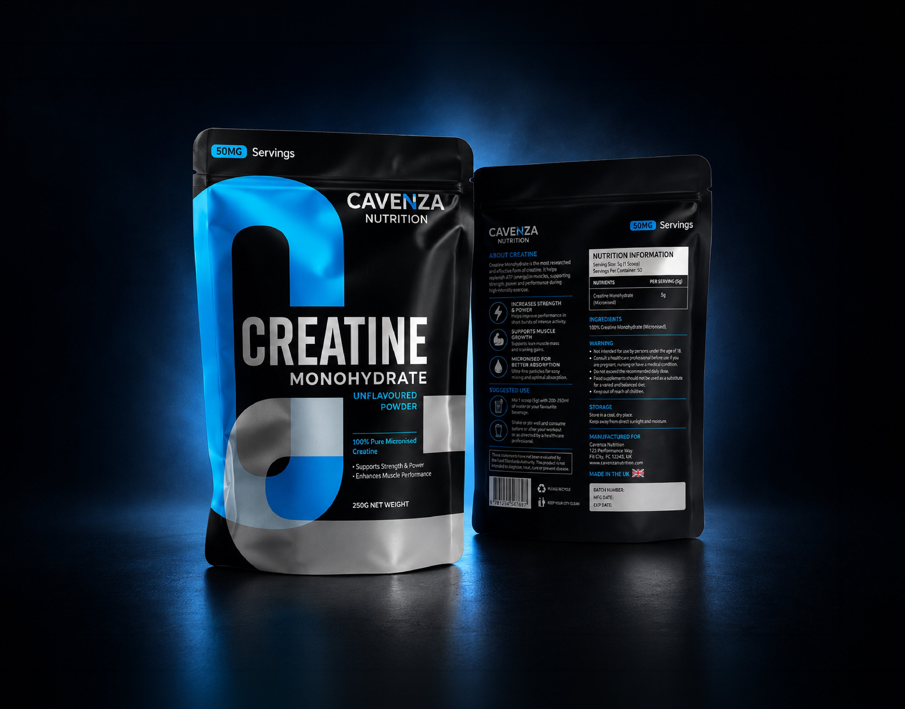
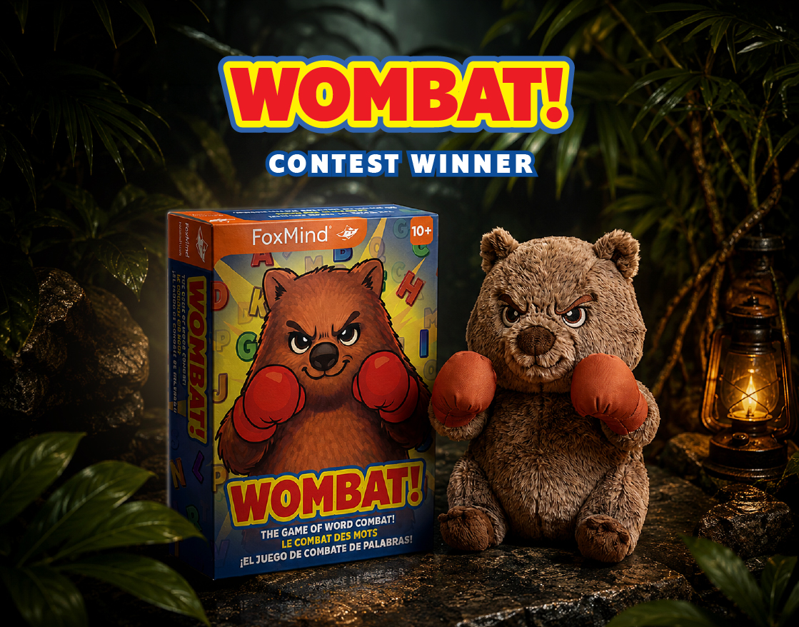

# 📦 Packaging Design Portfolio

### Gayan Sandaruwan — Packaging & Label Designer

I create clean, strategic and production-ready packaging designs for consumer products and brands.

My work combines strong visual communication, practical packaging structure and professional print-ready artwork.

---

## ⭐ Selected Work

### 💊 Supplement & Wellness Packaging

Packaging design for supplements, wellness products and health-focused brands, with a focus on strong visual hierarchy, product communication and professional presentation.

#### 💪 CAVENZA — Creatine Monohydrate Packaging

A premium sports nutrition pouch packaging concept featuring a bold black, electric-blue and metallic visual system.

**Packaging:** Stand-Up Pouch  
**Category:** Sports Nutrition / Supplement Packaging  
**Focus:** Packaging Design • Brand Visual System • Front & Back Artwork

**[View CAVENZA Case Study →](./cavenza-creatine-packaging/)**

---

### 🎲 Game & Retail Packaging

Creative retail packaging designed to communicate the product clearly and create strong shelf presence.

#### 🐻 WOMBAT! — Word Game Packaging

A playful and energetic board game packaging concept developed for **WOMBAT!**, a fast-paced word combat game by FoxMind.

The project combines character illustration, bold typography, colorful game assets and a distinctive retail packaging system.

**Packaging:** Retail Game Box  
**Category:** Board Game / Family Game  
**Focus:** Packaging Design • Brand Identity • Character Illustration • Retail Presentation

**[View WOMBAT Case Study →](./wombat-word-game-packaging/)**

---

### 🧴 Skincare & Beauty Packaging

Premium packaging systems for skincare and beauty products, including boxes, bottles and labels.

**Focus:**  
Brand consistency • Product presentation • Label hierarchy • Print-ready artwork

---

### 🛍️ Pouch & Flexible Packaging

Modern pouch and flexible packaging designs for consumer products.

**Focus:**  
Front/back panel design • Product information • Brand consistency • Print preparation

---

### 🏷️ Label Design

Professional labels created for bottles, jars, vials and other packaged products.

**Focus:**  
Typography • Information hierarchy • Brand identity • Production specifications

---

## 🛠️ Design Services

- Product Packaging Design
- Box & Carton Packaging
- Pouch & Flexible Packaging
- Label Design
- Supplement Packaging
- Skincare & Beauty Packaging
- Amazon Product Packaging
- Dieline Adaptation
- Print-Ready Artwork
- Packaging Mockups

---

## 🎨 Tools

- Adobe Illustrator
- Adobe Photoshop
- Adobe InDesign
- Adobe Firefly
- AI-assisted creative tools

---

## 📋 Typical Deliverables

- Print-ready artwork
- CMYK production files
- Dieline-based packaging artwork
- 3D packaging mockups
- Label artwork
- Box artwork
- Pouch artwork
- Editable source files

---

## 🌐 Portfolio & Contact

**Behance:**  
https://www.behance.net/GSandaru

**LinkedIn:**  
https://www.linkedin.com/in/sandaru-dissanayake-40488359/

**Instagram:**  
https://www.instagram.com/gsandaru1/

---

## 📁 About This Portfolio

This repository showcases selected packaging design projects, creative explorations and production-focused artwork by Gayan Sandaruwan.

Detailed case studies will be added as the portfolio grows.

---

## 📩 Available for Packaging Design Projects

Looking for professional packaging or label design?

**Packaging • Labels • Boxes • Pouches • Mockups • Print-Ready Artwork**
