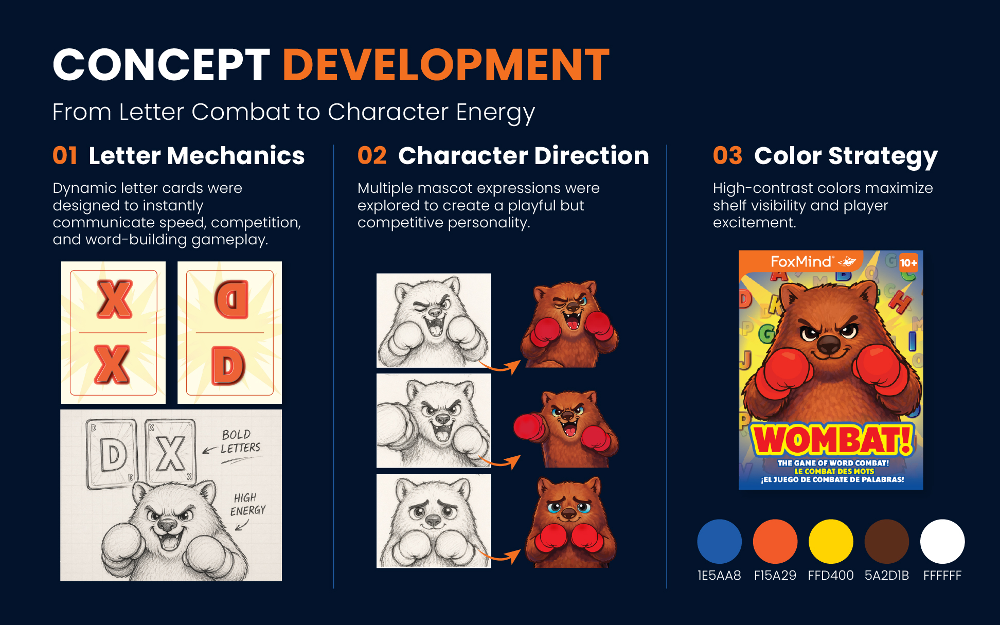
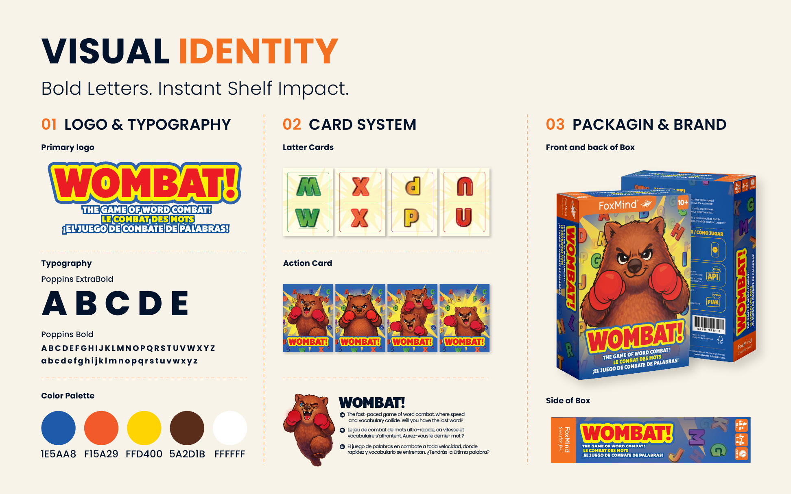
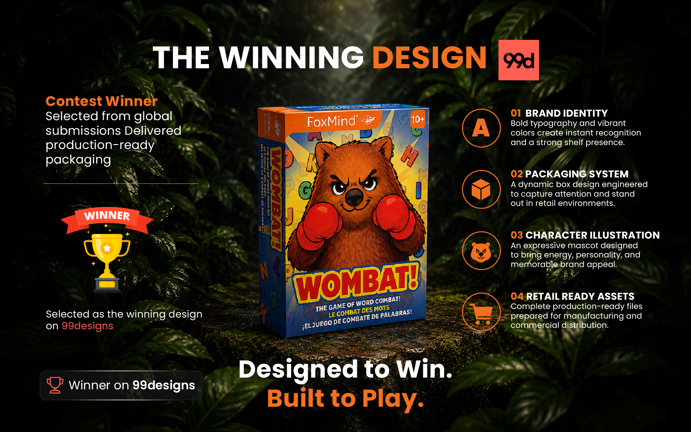
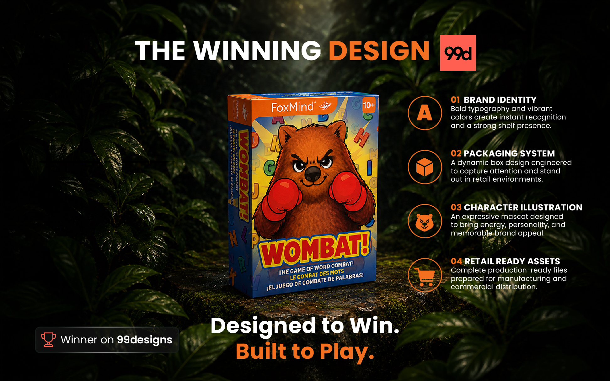

# 🐻 WOMBAT! — Word Game Packaging

### Contest-Winning Board Game Packaging & Brand Identity

A playful and energetic packaging design created for **WOMBAT!**, a fast-paced word combat game by FoxMind.

The project combines character illustration, bold typography, colorful game assets and retail-focused packaging to create a distinctive visual identity for a family-friendly board game.

---

## 🏆 Contest Winner

The WOMBAT! packaging design was selected as a **winning design on 99designs**.

The final concept was developed into a production-ready packaging system with a strong retail presence and a memorable character-driven identity.

---

## 🎮 Project Overview

**Brand:** FoxMind  
**Product:** WOMBAT! — The Game of Word Combat  
**Category:** Board Game / Family Game  
**Packaging:** Retail Game Box  
**Project Type:** Packaging Design & Brand Identity

---

## 💡 Concept Development

The concept development explored three key areas:

- Letter-based game mechanics
- Character and mascot direction
- High-contrast color strategy

The goal was to communicate the competitive and energetic nature of the game through bold visuals and expressive character design.

---

## 🎨 Visual Identity

The visual identity was built around a bold and playful system combining:

- Strong custom logo treatment
- Character-driven graphics
- Bold typography
- Colorful letter cards
- Consistent game card artwork
- Retail packaging graphics

### Color Palette

- Blue — `#1E5AA8`
- Orange — `#F15A29`
- Yellow — `#FFD400`
- Brown — `#5A2D1B`
- White — `#FFFFFF`

### Typography

**Primary:** Poppins ExtraBold  
**Supporting:** Poppins Bold

---

## 🏅 Winning Design

The final winning concept brings together the character illustration, bold WOMBAT! branding and colorful alphabet graphics into a distinctive retail package.

The packaging was designed to create immediate shelf recognition while communicating the playful competitive nature of the game.

---

## 📦 Final Packaging

The final box design combines the front, side and back packaging artwork into a complete retail-ready system.

The design maintains consistent branding across all packaging panels while using the wombat character as the central visual element.

---

## 🎯 Design Focus

- Board Game Packaging
- Character Illustration
- Brand Identity
- Retail Packaging
- Typography
- Color Strategy
- Game Card Design
- Packaging Mockups
- Production-Ready Artwork

---

## 🛠️ Design Tools

- Adobe Illustrator
- Adobe Photoshop
- Adobe Firefly
- AI-assisted creative tools

---

## 📋 Deliverables

- Packaging Design
- Brand Visual Identity
- Character Illustration Direction
- Game Card Visual System
- Box Artwork
- Retail Packaging Mockup
- Presentation Artwork

---

## 👤 Designer

**Gayan Sandaruwan**  
Packaging & Label Designer

**Behance:**  
https://www.behance.net/GSandaru

**LinkedIn:**  
https://www.linkedin.com/in/sandaru-dissanayake-40488359/

**Instagram:**  
https://www.instagram.com/gsandaru1/

---

### 📩 Available for Packaging Design Projects

**Packaging • Labels • Boxes • Pouches • Mockups • Print-Ready Artwork**
